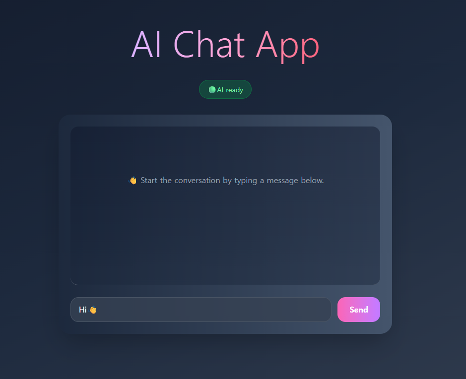

# AI Chat App

[🇰🇷 한국어 README](./README.kr.md)

This is a React-based web application that simulates an AI-powered chat interface. Built with Vite and styled using Tailwind CSS, this project provides a fast, minimal, and responsive user experience.

## 🧠 Features

- Smart and clean chat UI
- Fully responsive design
- Built with Vite for fast development
- Tailwind CSS utility-first styling
- Easily connectable to OpenAI or other AI APIs

## 📸 Preview

 

## 🚀 Getting Started

### Prerequisites

- Node.js and npm installed

### Installation

```bash
git clone https://github.com/DevFayzullo/ai-chat-app.git
cd ai-chat-app
npm install
```

### Run in Development Mode

```bash
npm run dev
```

### Build for Production

```bash
npm run build
```

## 🌐 Live Demo

👉 [Click here to view the live demo](https://DevFayzullo.github.io/ai-chat-app/) <!-- Replace with actual link -->

## 🛠️ Tech Stack

- React 19
- Vite
- Tailwind CSS 4
- JavaScript (ES6+)
- ESLint

## 📄 License

This project is licensed under the MIT License.

---

📌 Developed by **DevFayzullo**  
> “The best way to predict the future is to invent it.” – Alan Kay

Happy coding! 🚀
